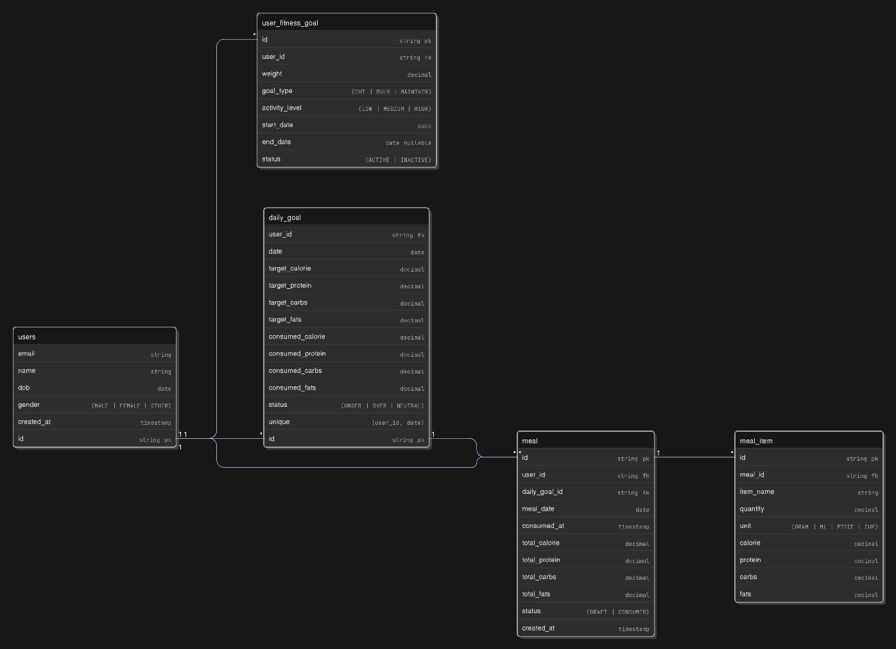

# Macromind API

Macromind API is a comprehensive food tracking and nutritional analysis system. It allows users to scan meals via images, automatically detect food items, and track daily nutritional intake against personalized goals.

## 📸 Overview

## 🚀 Key Features

- **Food Recognition**: Scan meal images to automatically detect food items.
- **Nutritional Insights**: Get detailed information for Calories, Carbs, Protein, and Fats per serving.
- **Meal Management**:
  - Saved as a **draft** initially.
  - Users can edit items, quantities, and nutrients.
  - Only **confirmed** meals affect daily tracking.
- **Daily Targets**:
  - Manual updates for nutrient goals.
  - Automatic calculation based on body profile (Weight, Age, Gender, Goal: Lean/Bulk).
- **Progress Tracking**:
  - Daily progress and history views.
    - **Nutrition Heatmap**: Yearly visualization of intake consistency, showing calorie totals on hover for each individual day.

## 🏗️ Core Entities

- **User**: Managed via OAuth/Email, includes personal heatmap data.
- **Meal**: Contains ID, timestamp, a list of MealItems, and total nutrients.
- **MealItem**: Individual food items with name, quantity, and specific nutrients.
- **Goals**: 
  - `UserGoal`: Desired calorie and macro targets.
  - `DailyGoal`: Aggregated tracking for the day.

## 🛠️ Technology Stack

- **Backend**: Java, Spring Boot
- **Security**: JWT Authentication, OAuth
- **Database**: MySQL (configured in `application.properties`), redis (planned for caching)
- **Build Tool**: Maven
